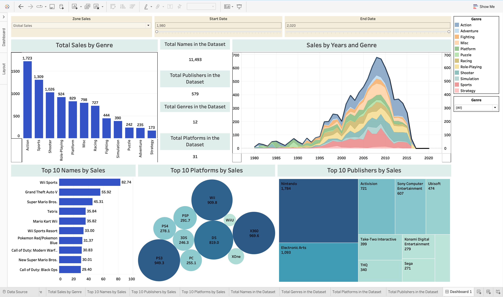

# sales-dashboard-tableau
I created an interactive Tableau dashboard using a video game sales dataset to analyze global trends from 1980 to 2016. It highlights top games, publishers, genres, and regional sales. Users can filter by platform, year, and genre to explore patterns and insights across the gaming industry.

# 🎮 Video Game Sales Dashboard | Tableau Public

I have created an interactive **Video Game Sales Dashboard** using **Tableau Public** to explore and analyze global video game sales data from 1980 to 2020. The dashboard offers insights into top-performing games, genres, publishers, and platforms using visualizations like bar charts, area charts, bubble charts, and treemaps.

---

## 🔗 Live Dashboard

👉 [View on Tableau Public](https://public.tableau.com/app/profile/yukti.dave/viz/Sales-dashboard_17509179579440/Dashboard1?publish=yes)  

---

## 📊 Dashboard Highlights

- **Total Sales by Genre**  
  Compare cumulative global sales by game genre (e.g., Action, Sports, Shooter).

- **Sales Over Time (1980–2020)**  
  Visualizes trends across genres using an area chart.

- **Top 10 Video Games by Sales**  
  Includes top titles like *Wii Sports*, *Grand Theft Auto V*, *Tetris*, and more.

- **Top Platforms by Sales**  
  Displays performance of consoles like PS3, Wii, X360, and DS using a bubble chart.

- **Top Publishers by Sales**  
  Shows leading publishers like Nintendo, EA, and Activision using a treemap.

- **Dataset Summary**:
  - 🎮 11,493 Game Titles
  - 🏢 579 Publishers
  - 🕹️ 31 Platforms
  - 🎯 12 Genres

- **Interactive Filters**:
  - Filter by Region (e.g., Global, NA, EU, JP)
  - Year range slider (1980–2020)
  - Genre dropdown filter

---

## 📁 Files in This Repository
├── vgsales.csv                # Dataset used
├── SalesDashboard.twbx        # Tableau packaged workbook
├── screenshots/
│   └── dashboard.png          # Dashboard preview image
└── README.md                  # Project overview and documentation

---

## 📈 Dataset Description

- Source: [vgsales.csv](https://www.kaggle.com/datasets/gregorut/videogame-sales-with-ratings)  
- Contains detailed sales data for over 11,000 video games, including:
  - Name, Genre, Platform, Publisher, Year
  - Regional and Global Sales (in millions)

---

## 🛠️ Tools & Skills Used

- **Tableau Public** for data visualization
- Data filtering, grouping, and aggregation
- Interactive dashboard design
- Insight extraction and storytelling

---

## 🖼️ Dashboard Preview

---

## 📌 How to Use

1. **View Online**: Click the Tableau Public link above.
2. **Download Locally**:
   - Download `SalesDashboard.twbx`
   - Open in [Tableau Public Desktop](https://public.tableau.com/en-us/s/download/)

---

## 💡 Key Insights

- **Action** is the highest-selling genre with 1,723 million+ global units sold.
- **Wii Sports** leads as the top-selling game at 82.74 million units.
- **Nintendo** dominates as the highest-selling publisher.
- Sales peaked between **2005 and 2010**, driven by platforms like PS3, X360, and Wii.

---

## 📬 Contact : https://www.linkedin.com/in/yuktidave , yuktidave1212@gmail.com

Feel free to connect if you're interested in this project or want to collaborate!

